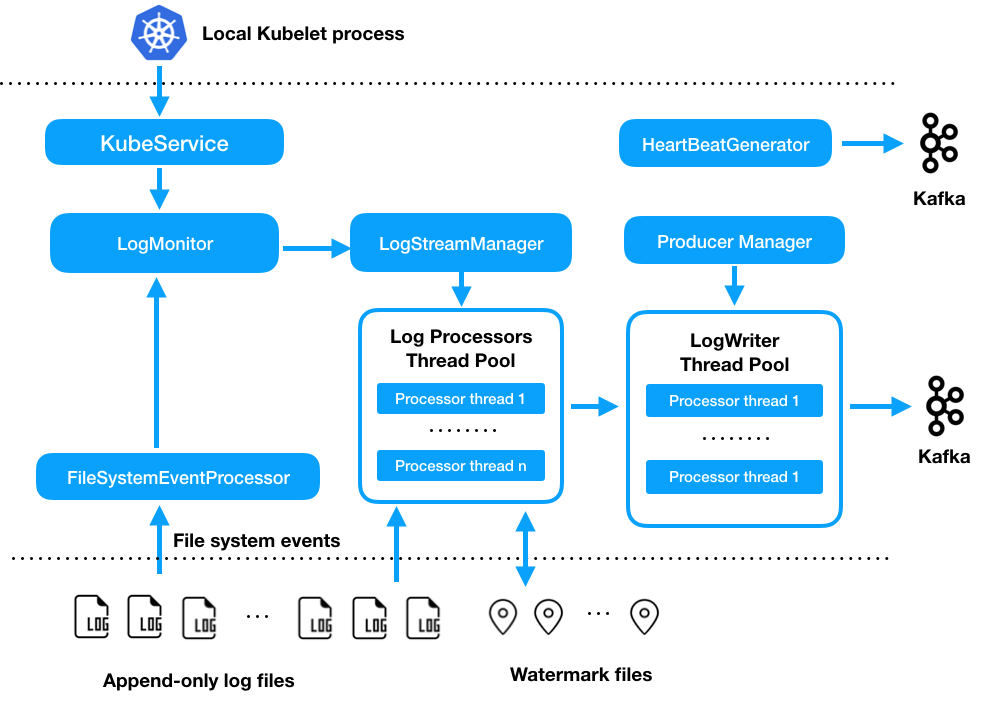

##  &nbsp;  Singer Internals

The diagram below shows the Singer internals. 
In detail, Singer listens to the file system events on a set of logging directories 
based on configurations, and process log streams when new data comes in. 
To achieve high throughput, Singer uses multiple thread pools for parallel processing. 
Singer uses a LogProcessor thread pool to process log streams, 
and uses a separate LogWriter thread pool to write messages to Kafka. 
Singer has a heartbeat thread that periodically sends a heartbeat message with its current processing 
status to a central Kafka topic. This central topic can be used or monitoring and alerting on Singer status. 

Singer uses `file inode + offset` as the watermark position to track its progress, 
and writes the watermark info to disk after it writes a batch of messages of kafka.
It resumes from the last watermark position after restarting. 
Because of this, Singer requires that a log stream is a sequence of append-only log files, 
and uses **file renaming** for log rotation.
Singer does not handle log streams that use file copy and truncation for log rotation,
because Singer cannot use `file inode + offset` to uniquely identify log messages
when a log file is copied and truncated.  
